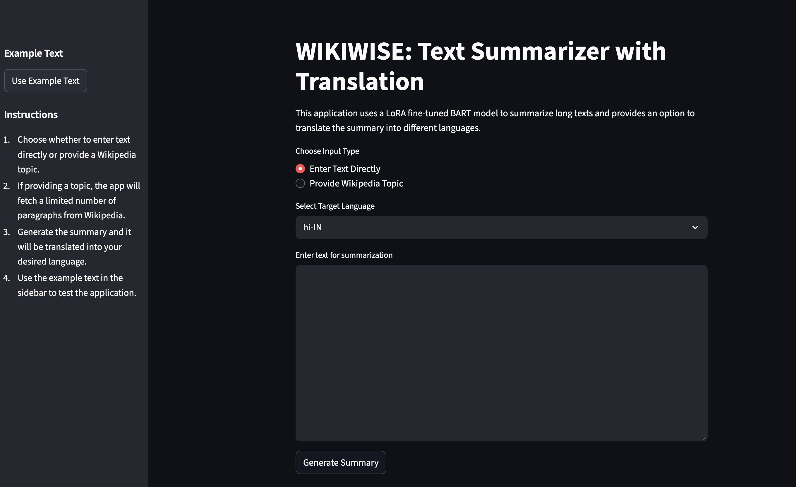

# 🧠 WIKIWISE: LLM-Powered Text Summarizer & Translator

**WIKIWISE** is a Streamlit-based web application that leverages a **Large Language Model (LLM)** to perform high-quality **text summarization** and **translation**. It uses a **LoRA fine-tuned BART model** for context-aware summaries and the **Sarvam AI API** to translate results into various Indian languages.

---

## 🚀 Features

- ✍️ **Input Options**: Enter free-form text or provide a Wikipedia topic.
- 🤖 **LLM-Based Summarization**: Uses `ainize/bart-base-cnn`, fine-tuned with LoRA for efficient, contextual summarization.
- 🌐 **Multilingual Translation**: Translates summaries into Indian languages (Hindi, Punjabi, Tamil, Bengali, etc.) via Sarvam AI.
- ⚡ **Simple UI**: Built with Streamlit for ease of use and instant interaction.

---

## 🧩 How It Works

1. Input text or a Wikipedia topic is provided.
2. The **LoRA fine-tuned BART model** summarizes the input.
3. The **Sarvam AI API** translates the summary into the selected Indian language.

> The use of LLM ensures **semantic understanding**, **grammatical fluency**, and **intelligent abstraction** far beyond extractive approaches.

---

